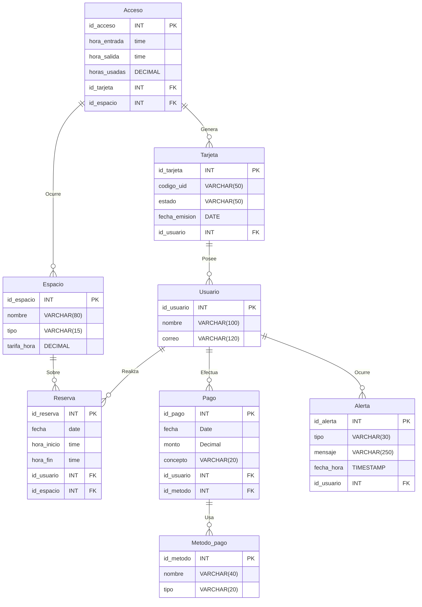

# Taller Bases de Datos

## MODELO RELACIONAL

```mermaid
erDiagram
    Usuario {
        id_usuario INT PK
        nombre VARCHAR(100)
        correo VARCHAR(120)
    }
    Tarjeta {
        id_tarjeta INT PK
        codigo_uid VARCHAR(50)
        estado VARCHAR(50)
        fecha_emision DATE
        id_usuario INT FK
    }
    Espacio {
        id_espacio INT PK
        nombre VARCHAR(80)
        tipo VARCHAR(15)
        tarifa_hora DECIMAL
    }
    Reserva {
        id_reserva INT PK
        fecha date
        hora_inicio time
        hora_fin time
        id_usuario INT FK
        id_espacio INT FK
    }
    Acceso {
        id_acceso INT PK
        hora_entrada time
        hora_salida time
        horas_usadas DECIMAL
        id_tarjeta INT FK
        id_espacio INT FK
    }
    Metodo_pago {
        id_metodo INT PK
        nombre VARCHAR(40)
        tipo VARCHAR(20)
    }
    Pago {
        id_pago INT PK
        fecha Date
        monto Decimal
        concepto VARCHAR(20)
        id_usuario INT FK
        id_metodo INT FK
    }
    Alerta {
        id_alerta INT PK
        tipo VARCHAR(30)
        mensaje VARCHAR(250)
        fecha_hora TIMESTAMP
        id_usuario INT FK
    }

    %% RELACIONES (FLECHAS)
    Acceso ||--o{ Espacio : "Ocurre"
    Acceso ||--o{ Tarjeta : "Genera"
    Espacio ||--o{ Reserva : "Sobre"
    Tarjeta ||--o{ Usuario : "Posee"
    Usuario ||--o{ Reserva : "Realiza"
    Usuario ||--o{ Alerta : "Ocurre"
    Usuario ||--o{ Pago : "Efectua"
    Pago ||--o{ Metodo_pago : "Usa"

```
---
